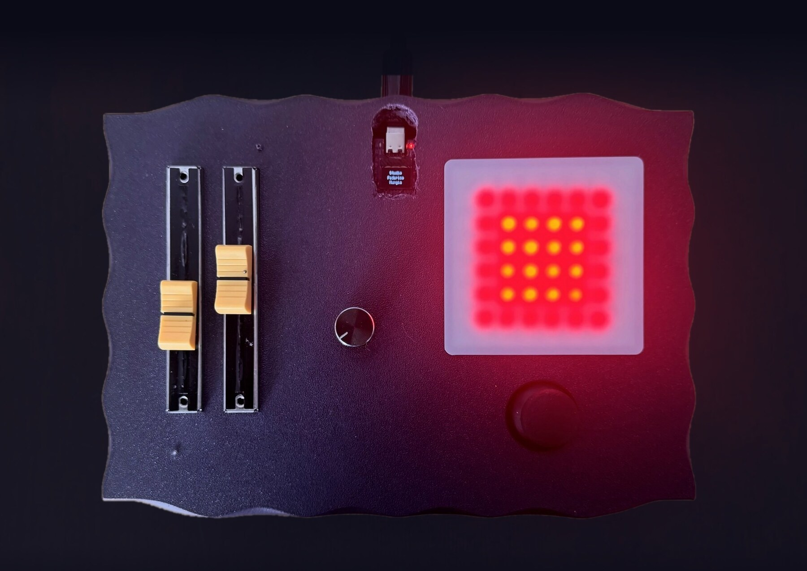
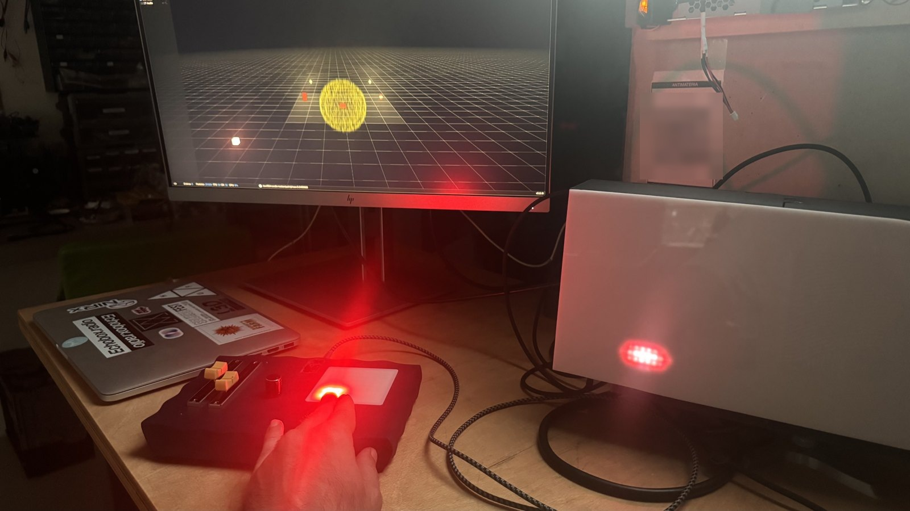
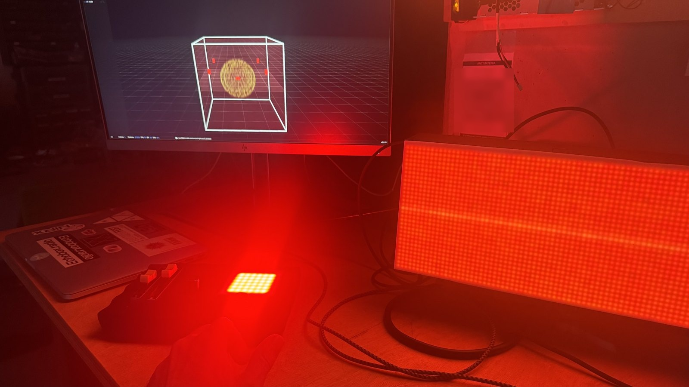
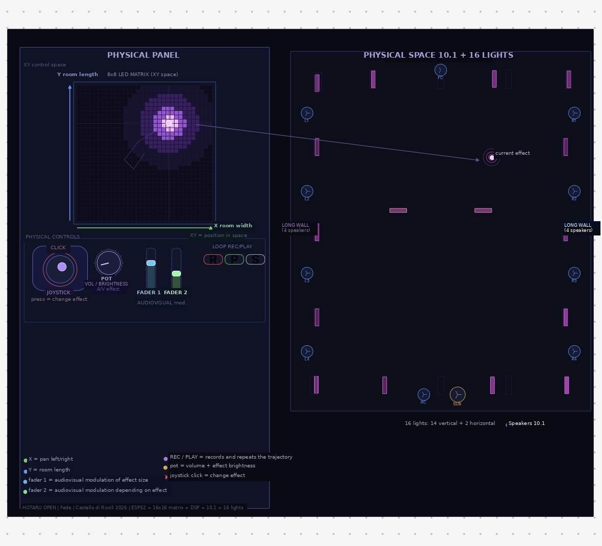
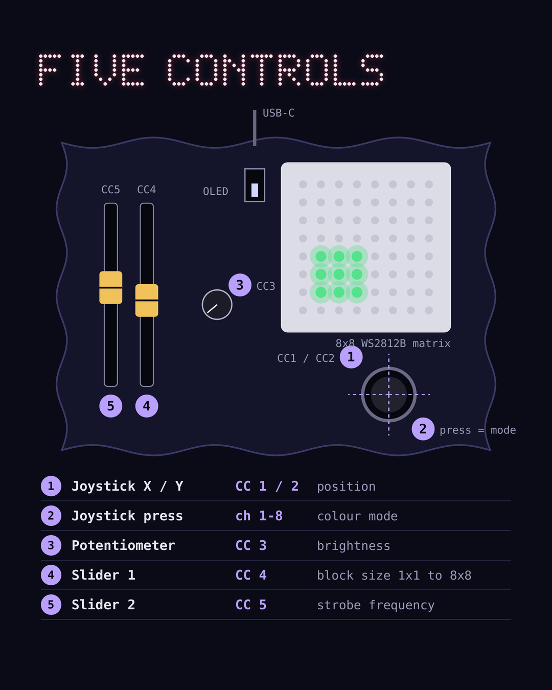
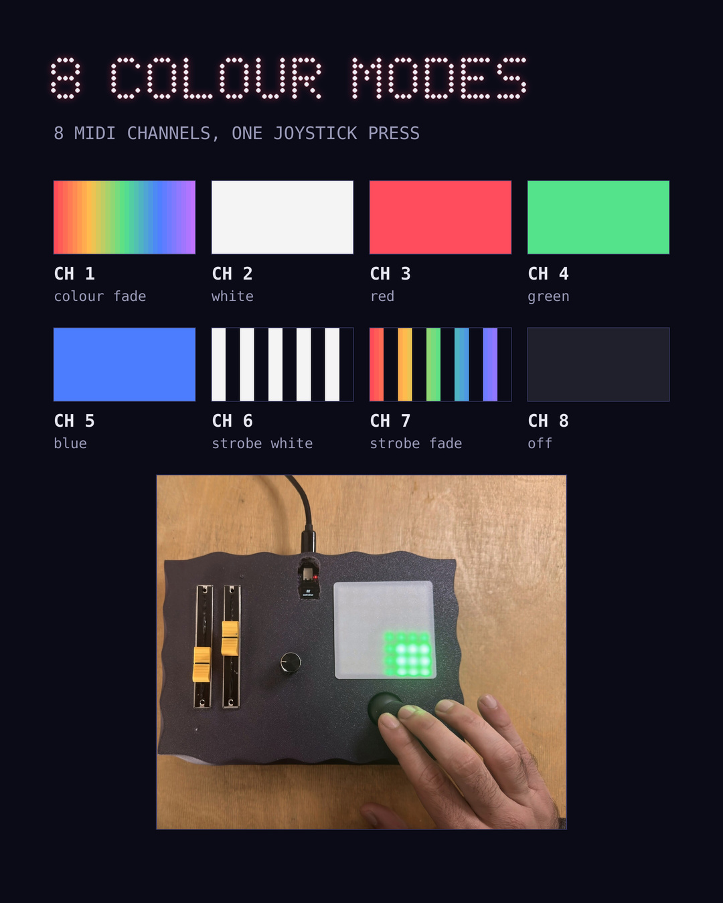
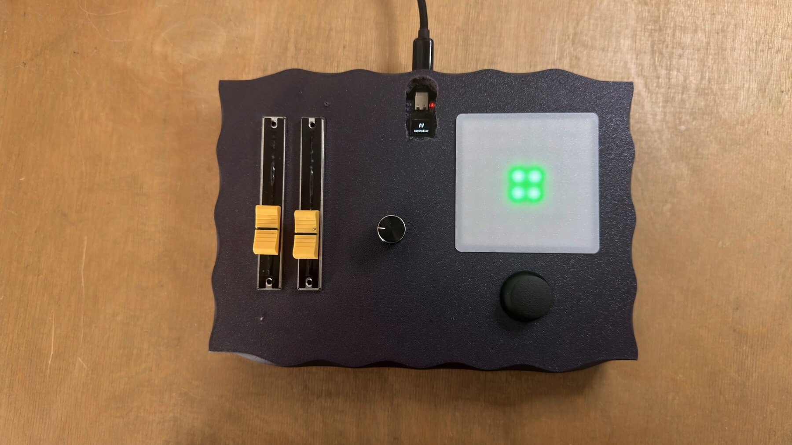
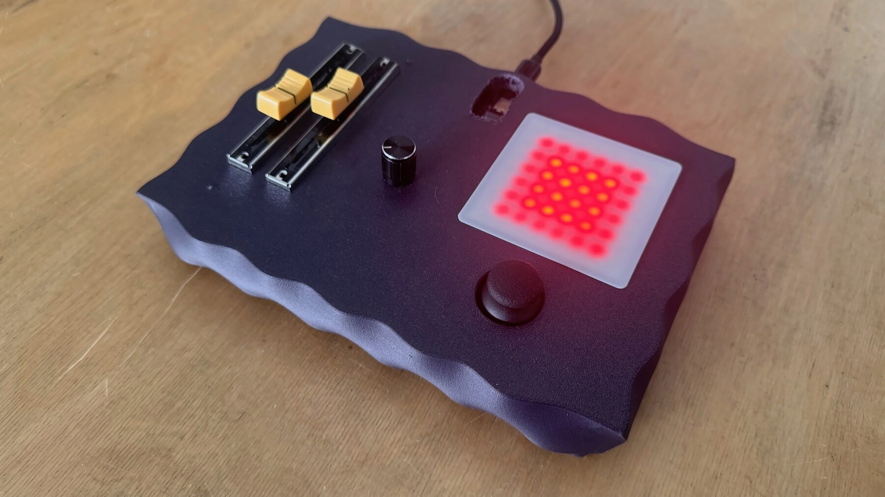
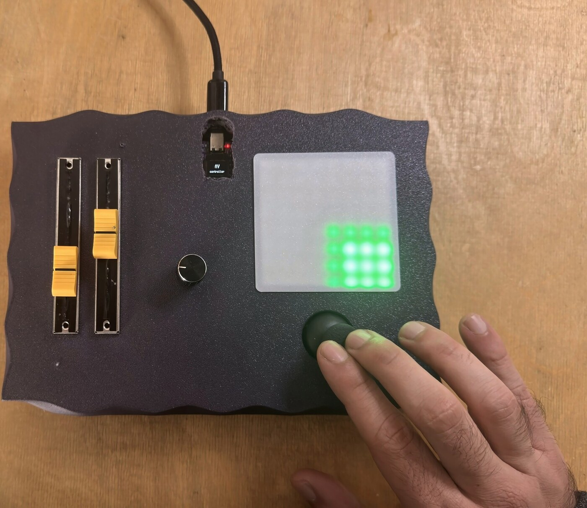
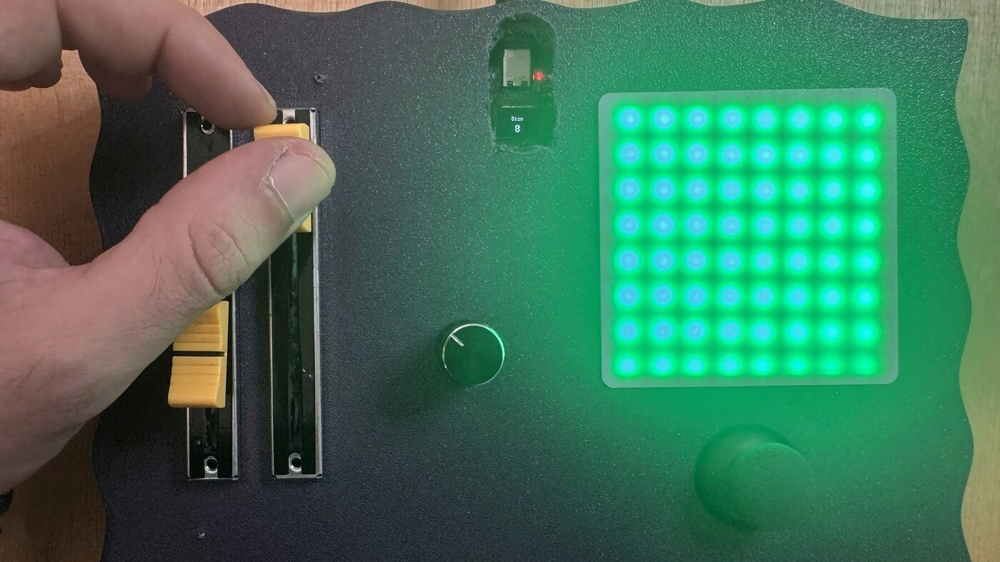

# AV Spatializer

**A five-control audiovisual controller by Studio Federico Murgia (beta)**

A joystick, a potentiometer and two sliders, with an 8×8 WS2812B LED matrix
under a frosted diffuser that shows what the controls are doing as light:
position, block size, brightness, colour and strobe. Built on an ESP32, in a
3D-printed enclosure.

---

> [!WARNING]
> **Photosensitive epilepsy.** Two of the eight colour modes strobe the matrix
> at 1–20 Hz. Do not build or operate it if you are sensitive to
> photosensitive epilepsy.

> [!NOTE]
> **This is the beta.** It works, and it will change before a small limited
> edition. Two firmware variants exist and they
> do not do the same thing yet; see [Firmware](#firmware).

## What this is

The controller was first built as a spatializer: the joystick moves a sound
source around the room in 4DSOUND, a slider sets its size, and the LED matrix
mirrors where the source sits and how large it is.

<table>
<tr>
<td width="50%"></td>
<td width="50%"></td>
</tr>
<tr>
<td align="center"><em>The source made smaller and moved to the bottom left.</em></td>
<td align="center"><em>The same source enlarged and left in the centre.</em></td>
</tr>
</table>

It was then configured and performed for **Hotaru Open** with John Bringwolves
at Castello di Rivoli (May 2026, ADRenaline programme), where the joystick
positioned an audiovisual effect across a 10.1 speaker system and 16 lights.

<em>The control scheme built and performed for Hotaru Open.</em>

Outside that setup it is a general-purpose controller: five continuous values
and a mode switch, readable by anything that takes MIDI or serial.

## Specifications

| | |
|---|---|
| **Controls** | 2-axis analog joystick with push, 1 rotary potentiometer, 2 slide potentiometers |
| **Display** | 8×8 WS2812B matrix (64 px) under a frosted diffuser |
| **Beta unit (pictured)** | ESP32-C3 board with onboard 0.42" 72×40 SSD1306 OLED, USB serial output |
| **BLE MIDI variant** | Classic ESP32, no screen, BLE MIDI Control Change output |
| **Frame rate** | 50 fps matrix update |
| **Enclosure** | 3D printed, two parts: top 217 × 157 × 26 mm, bottom 200 × 140 × 13.3 mm |

## Contents

| Path | What |
|------|------|
| [`docs/WIRING.md`](docs/WIRING.md) | Pin tables for both boards, matrix layout, power notes |
| [`docs/SERIAL.md`](docs/SERIAL.md) | The tagged serial stream from the ESP32-C3 firmware |
| [`docs/MIDI.md`](docs/MIDI.md) | The BLE MIDI map from the ESP32 firmware |
| [`docs/AV_Spatializer.pdf`](docs/AV_Spatializer.pdf) | Two-page overview sheet |
| [`firmware/`](firmware/) | Both firmware variants as PlatformIO projects |
| [`examples/`](examples/) | A minimal Python reader for the serial stream |
| [`hardware/enclosure/`](hardware/enclosure/) | Printable enclosure STLs |

## Controls

| # | Control | On the matrix | BLE MIDI variant |
|:-:|---------|---------------|------------------|
| 1 | Joystick X / Y | Position of the lit block | CC 1 / CC 2 |
| 2 | Joystick press | Next colour mode (8 modes) | Channel = mode (1–7) |
| 3 | Potentiometer | Brightness | CC 3 |
| 4 | Slider 1 | Block size, 1×1 to 8×8 | CC 4 |
| 5 | Slider 2 | Strobe frequency, 1–20 Hz | CC 5 |

Odd block sizes above 1 are drawn as the next even size with a dimmed outer
ring (about 20% brightness).

The joystick centre is **calibrated at power-up** from 32 samples. Leave the
joystick untouched while the unit boots, or the centre will be offset for the
whole session.

### Colour modes

| Mode | Colour | MIDI channel (BLE variant) |
|:----:|--------|:--------------------------:|
| 0 | Colour fade (hue cycles every frame) | 1 |
| 1 | White | 2 |
| 2 | Red | 3 |
| 3 | Green | 4 |
| 4 | Blue | 5 |
| 5 | Strobe white | 6 |
| 6 | Strobe fade | 7 |
| 7 | Off, matrix dark, no output | none |

## Build

### Bill of materials

- ESP32-C3 board with onboard 0.42" 72×40 SSD1306 OLED (I²C on GPIO 5/6) for
  the beta unit, **or** a classic ESP32 dev board for the BLE MIDI variant
- 8×8 WS2812B matrix
- 2-axis analog thumb joystick with push button
- 1 rotary potentiometer, 2 slide potentiometers
- Frosted / opal acrylic for the diffuser
- Filament for the two enclosure parts
- Hook-up wire, USB cable

### Wiring

Pin tables for both boards: **[`docs/WIRING.md`](docs/WIRING.md)**.

### Enclosure

Two printed parts in [`hardware/enclosure/`](hardware/enclosure/).

<table>
<tr>
<td width="50%"></td>
<td width="50%"></td>
</tr>
</table>

## Firmware

Two PlatformIO projects in [`firmware/`](firmware/). They share the same
control logic (joystick calibration, block drawing, colour modes, strobe) and
differ in output:

| | [`esp32c3-oled`](firmware/esp32c3-oled/) | [`esp32-blemidi`](firmware/esp32-blemidi/) |
|---|---|---|
| Board | ESP32-C3 with 0.42" OLED (the pictured beta) | Classic ESP32 |
| Output | USB serial, tagged stream, 50 Hz | BLE MIDI CC, ≤10 Hz per change |
| Screen | Shows brightness, size, strobe Hz, X/Y | None |
| Brightness | Pot sets 0–255 directly | Pot scaled per mode and block size, FastLED power cap |

**BLE MIDI is not yet in the ESP32-C3 firmware.** The C3 has Bluetooth LE, so
merging the two is the next step for the beta.

## Using it

<table>
<tr>
<td width="50%"></td>
<td width="50%"></td>
</tr>
<tr>
<td align="center"><em>Joystick moving the block.</em></td>
<td align="center"><em>Block at full 8×8 size.</em></td>
</tr>
</table>

- **BLE MIDI variant:** pair "AV Controller" as a Bluetooth MIDI device
  (macOS: Audio MIDI Setup → MIDI Studio → Bluetooth), then MIDI-learn the five
  CCs in Ableton Live, TouchDesigner, Max, Pure Data or any MIDI host.
- **ESP32-C3 beta:** open the USB serial port at 115200 baud and parse the
  stream; [`docs/SERIAL.md`](docs/SERIAL.md) has the format and
  [`examples/serial_reader.py`](examples/serial_reader.py) a working reader.

## Try one

Build your own from this repo, or get in touch: depending on the project, a beta
unit can be lent or sold at a small price. Whatever you find while building,
testing or breaking it, open an issue; the feedback goes into the limited
edition.

## License

- **Firmware and example code:** MIT, see [`LICENSE`](LICENSE)
- **Documentation, images and enclosure design:** CC BY-SA 4.0

## Credits

Built on [FastLED](https://github.com/FastLED/FastLED),
[U8g2](https://github.com/olikraus/u8g2) and
[NimBLE-Arduino](https://github.com/h2zero/NimBLE-Arduino).

AV Spatializer is a project by **Studio Federico Murgia**.
